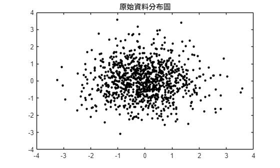
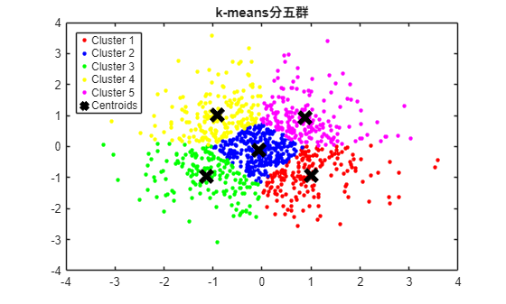
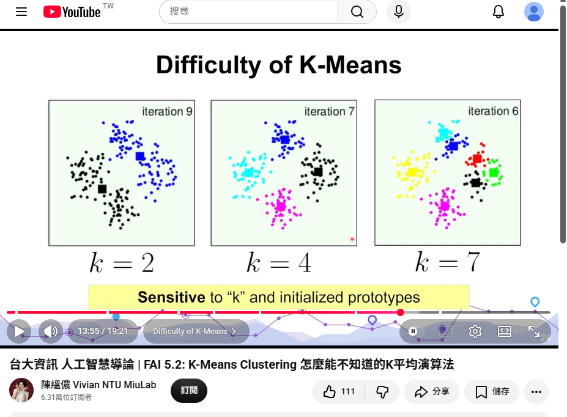
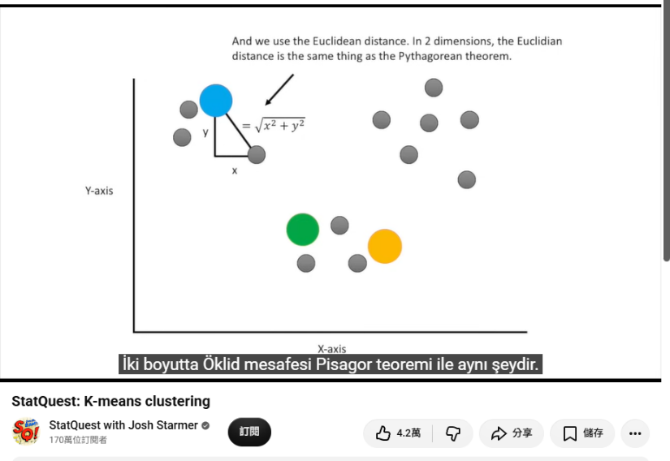

## 實作流程

### 程式初始化

使用 clc 清除命令視窗文字、clear 清除工作區變數，並以 close all 關閉圖形視窗。

### 建立二維資料

設定 number = 1000，以 randn(number, 2) 產生二維常態隨機資料。

### 觀察原始分布

以黑色點標記繪製 X 的兩個座標欄位，觀察資料分布。

### 執行五群分群

呼叫 kmeans(X, 5)，取得每筆資料的群別、五個群中心與距離資訊。

### 呈現分群結果

用紅、藍、綠、黃、洋紅色區分五群，再以黑色叉號標出群中心。X(Idx==1,1) 與 X(Idx==1,2) 分別是第一群的 X、Y 座標。

## 成果圖表

### 原始資料分布

文件中的原始資料圖，以黑點呈現二維資料。

### K-means 分成五群

文件中的實作結果，以五種顏色區分群別，黑色叉號為群中心。

## 函式輸出說明

| 輸出 | 說明 |
|---|---|
| `Idx` | 每筆資料所屬的群別編號。 |
| `Ctrs` | 每一群的中心座標。 |
| `SumD` | 各群內資料點到中心的距離總和；預設度量為平方歐氏距離。 |
| `D` | 每筆資料到每個群中心的距離；預設為平方歐氏距離。 |

距離定義參考 [MathWorks kmeans 官方文件](https://www.mathworks.com/help/stats/kmeans.html)。

## 程式整理說明

程式依原稿整理：統一 Idx 大小寫及小寫色碼，修正第一群 Y 座標的文字說明，加入 figure(2) 保留原始圖，並補上 hold off。圖像保留文件原圖；隨機資料與初始中心會使重新執行的結果不同。程式尚未在此環境以 MATLAB 執行。

## 心得與遇到的問題

在今天的課程中，我學習了 K-means 分群法。這是一種利用計算資料點與中心點距離來進行分類的演算法。它的運作流程是：在計算完點對點的距離並歸類後，會重新計算出新的中心點，並不斷重複這個迭代過程，直到中心點不再變動（收斂）或達到設定的上限次數為止。

在程式實作過程中，我也遇到了不少挑戰。例如打字時不小心少打了一個點{"Y."}，導致程式執行結果完全不同；另外也因為自訂的檔名與 函式庫撞名而引發報錯。這次的實作讓我深刻體會到程式語法的嚴謹性。總結來說，這堂課讓我收穫非常豐富，也很期待下一節課的內容！

## 補充學習資料

### 台大資訊 人工智慧導論｜FAI 5.2 K-Means Clustering

[前往 YouTube 觀看](https://youtu.be/KUSrYMsX5-U?si=kHmkuOFiXxRhWm1k)

### StatQuest: K-means clustering

[前往 YouTube 觀看](https://youtu.be/4b5d3muPQmA?si=jeTb1m_5RLTAuU93)
### 機器學習首部曲--- 聚類分析 K-means (字幕)

[前往 YouTube 觀看](https://youtu.be/LFGLcgeew5A?si=INBp93PP6iFFkUlS)

內容整理自 kmeans0923.docx。互動實驗室採用 JavaScript，Python 保留作為本機參考程式。
